# 🏗️ AI-DevOps Omni-Architect v43 - Architecture

## 🆕 Async Architecture Overview

v43 introduces asynchronous operations for improved performance and scalability.

## System Architecture Diagram

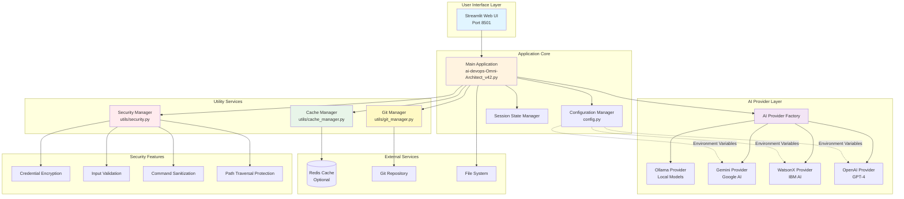

## Async Architecture Diagram (v43)

```mermaid
graph TB
    subgraph "User Interface Layer"
        UI[Streamlit Web UI<br/>Port 8501]
    end

    subgraph "Application Core"
        MAIN[Main Application v43<br/>ai-devops-Omni-Architect_v43.py]
        CONFIG[Configuration Manager<br/>config.py]
        SESSION[Session State Manager]
        ASYNC_CTRL[Async Controller]
    end

    subgraph "Async AI Provider Layer"
        ASYNC_FACTORY[Async AI Provider Factory]
        ASYNC_OLLAMA[Async Ollama Provider<br/>Concurrent Local Models]
        ASYNC_GEMINI[Async Gemini Provider<br/>Concurrent Google AI]
        ASYNC_WATSONX[Async WatsonX Provider<br/>Concurrent IBM AI]
        ASYNC_OPENAI[Async OpenAI Provider<br/>Concurrent GPT-4]
    end

    subgraph "Sync AI Provider Layer (Fallback)"
        FACTORY[AI Provider Factory]
        OLLAMA[Ollama Provider]
        GEMINI[Gemini Provider]
        WATSONX[WatsonX Provider]
        OPENAI[OpenAI Provider]
    end

    subgraph "Utility Services"
        SECURITY[Security Manager<br/>utils/security.py]
        ASYNC_CACHE[Async Cache Manager<br/>utils/async_cache_manager.py]
        CACHE[Cache Manager<br/>utils/cache_manager.py]
        ASYNC_HELPERS[Async Helpers<br/>utils/async_helpers.py]
        GIT[Git Manager<br/>utils/git_manager.py]
    end

    subgraph "External Services"
        REDIS[(Redis Cache<br/>Optional)]
        GITREPO[Git Repository]
        FILESYSTEM[File System]
    end

    UI --> MAIN
    MAIN --> CONFIG
    MAIN --> SESSION
    MAIN --> ASYNC_CTRL
    
    ASYNC_CTRL --> ASYNC_FACTORY
    ASYNC_CTRL --> FACTORY
    
    ASYNC_FACTORY --> ASYNC_OLLAMA
    ASYNC_FACTORY --> ASYNC_GEMINI
    ASYNC_FACTORY --> ASYNC_WATSONX
    ASYNC_FACTORY --> ASYNC_OPENAI
    
    FACTORY --> OLLAMA
    FACTORY --> GEMINI
    FACTORY --> WATSONX
    FACTORY --> OPENAI
    
    MAIN --> SECURITY
    MAIN --> ASYNC_CACHE
    MAIN --> CACHE
    MAIN --> ASYNC_HELPERS
    MAIN --> GIT
    
    ASYNC_CACHE --> REDIS
    CACHE --> REDIS
    GIT --> GITREPO
    MAIN --> FILESYSTEM
    
    CONFIG -.->|Environment Variables| ASYNC_GEMINI
    CONFIG -.->|Environment Variables| ASYNC_WATSONX
    CONFIG -.->|Environment Variables| ASYNC_OPENAI

    style UI fill:#e1f5ff
    style MAIN fill:#fff3e0
    style ASYNC_FACTORY fill:#c8e6c9
    style ASYNC_OLLAMA fill:#c8e6c9
    style ASYNC_GEMINI fill:#c8e6c9
    style ASYNC_WATSONX fill:#c8e6c9
    style ASYNC_OPENAI fill:#c8e6c9
    style ASYNC_CACHE fill:#b2dfdb
    style ASYNC_HELPERS fill:#b2dfdb
    style SECURITY fill:#ffebee
```

## Component Flow Diagram

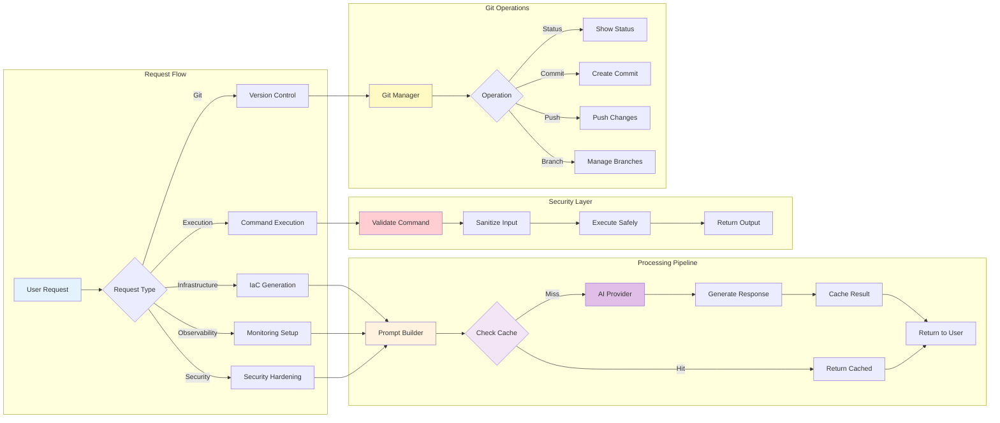

## Async Data Flow Architecture (v43)

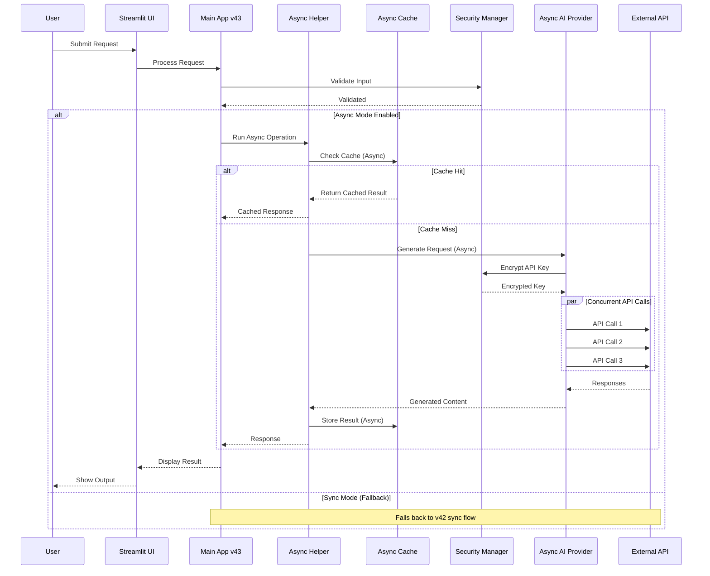

## Async Batch Processing Flow

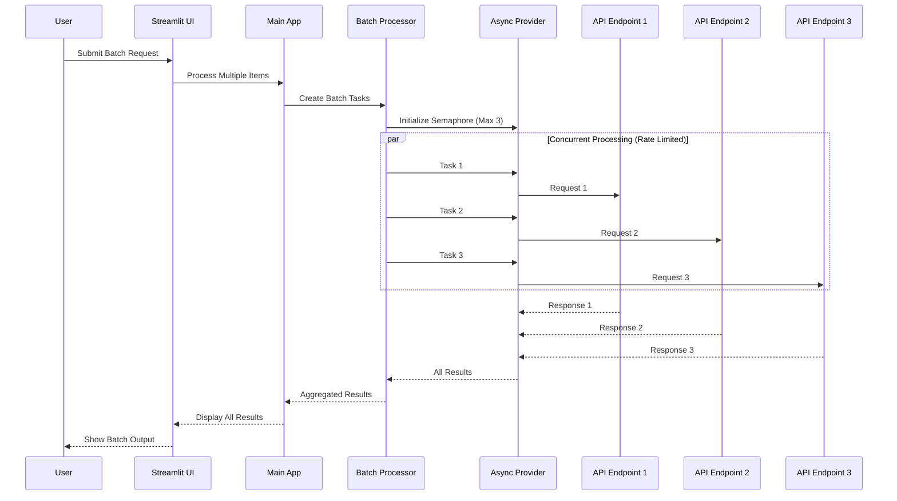

## Data Flow Architecture

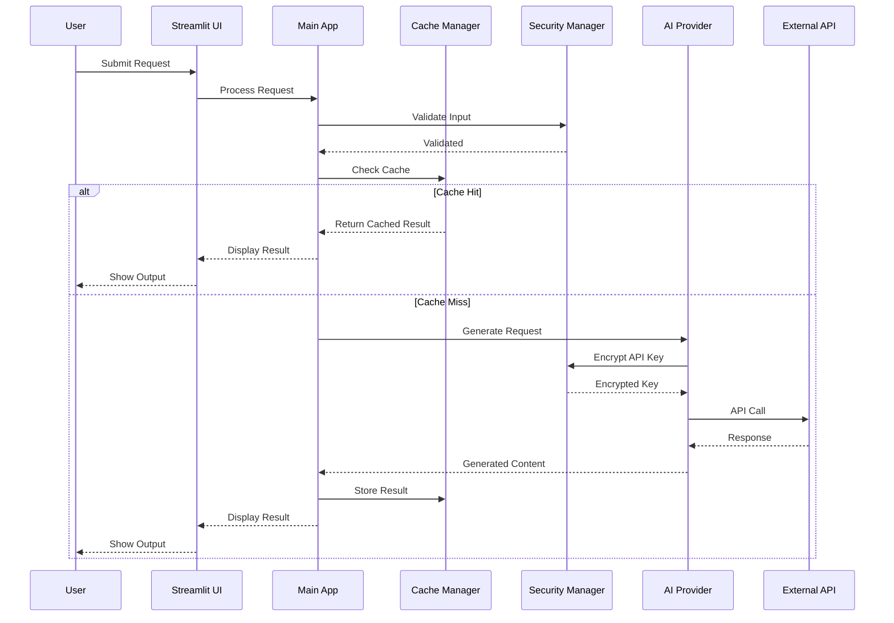

## Module Dependency Graph

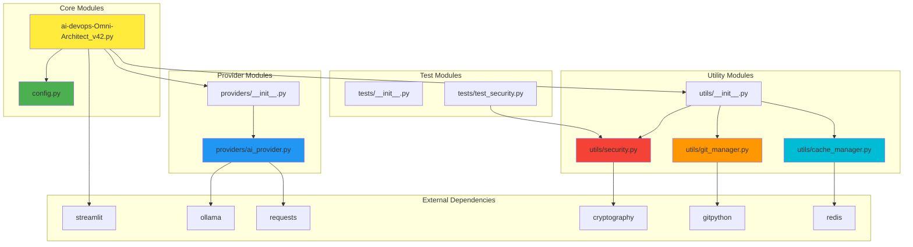

## Security Architecture

```mermaid
graph TB
    subgraph "Security Layers"
        INPUT[User Input]
        
        subgraph "Input Validation"
            VAL1[Type Validation]
            VAL2[Length Validation]
            VAL3[Format Validation]
        end
        
        subgraph "Path Security"
            PATH1[Path Normalization]
            PATH2[Traversal Detection]
            PATH3[Whitelist Check]
        end
        
        subgraph "Command Security"
            CMD1[Command Whitelist]
            CMD2[Argument Sanitization]
            CMD3[Shell Injection Prevention]
        end
        
        subgraph "Credential Security"
            CRED1[Encryption at Rest]
            CRED2[Secure Storage]
            CRED3[Key Rotation]
        end
        
        OUTPUT[Secure Execution]
    end

    INPUT --> VAL1
    VAL1 --> VAL2
    VAL2 --> VAL3
    VAL3 --> PATH1
    PATH1 --> PATH2
    PATH2 --> PATH3
    PATH3 --> CMD1
    CMD1 --> CMD2
    CMD2 --> CMD3
    CMD3 --> CRED1
    CRED1 --> CRED2
    CRED2 --> CRED3
    CRED3 --> OUTPUT

    style INPUT fill:#ffcdd2
    style OUTPUT fill:#c8e6c9
    style VAL1 fill:#fff9c4
    style PATH1 fill:#b3e5fc
    style CMD1 fill:#f8bbd0
    style CRED1 fill:#d1c4e9
```

## Deployment Architecture

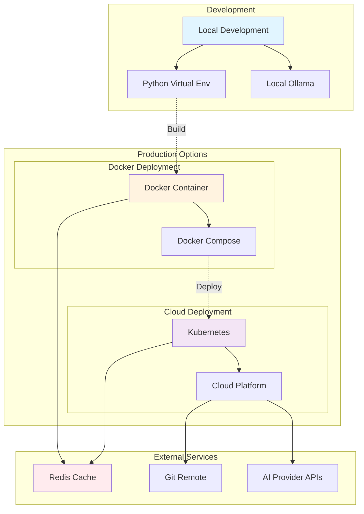

## Cache Strategy

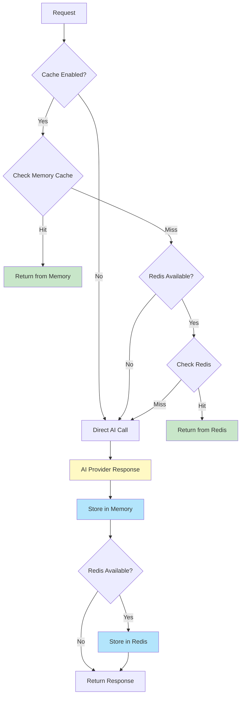

## Async Cache Strategy (v43)

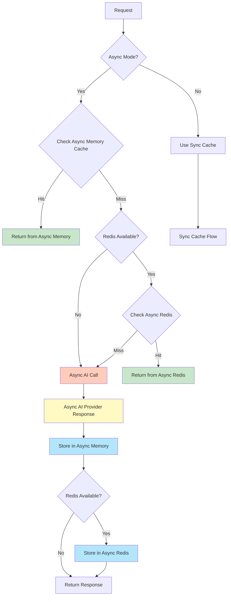

## Async Concurrency Control

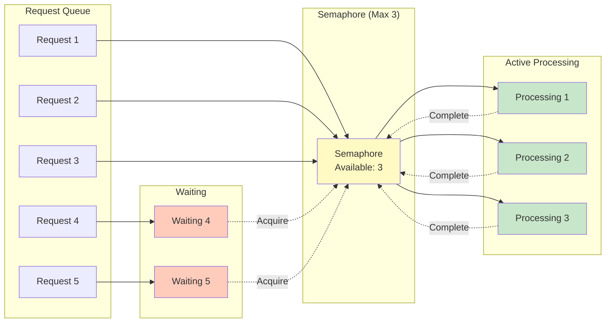

---

## Key Components

### 1. **Main Applications**
- **v43 (Async)** (`ai-devops-Omni-Architect_v43.py`)
  - Async-first architecture
  - Concurrent AI operations
  - Batch processing support
  - Toggle between async/sync modes
  - Enhanced performance monitoring

- **v42 (Stable)** (`ai-devops-Omni-Architect_v42.py`)
- Streamlit-based web interface
- Session state management
- Request routing and orchestration
- UI rendering and user interaction

### 2. **Configuration Manager** (`config.py`)
- Environment variable management
- Application constants
- Provider configurations
- Security settings

### 3. **AI Provider Layers**
- **Async Providers** (`providers/async_ai_provider.py`) ⚡ NEW!
  - Async abstract provider interface
  - Concurrent request handling
  - Batch generation support
  - Non-blocking operations
  - Token caching for watsonx
  - Thread pool for CPU-bound operations

- **Sync Providers** (`providers/ai_provider.py`)
  - Abstract provider interface
  - Multiple provider implementations
  - Unified API for all providers
  - Error handling and validation

### 4. **Security Manager** (`utils/security.py`)
- Credential encryption/decryption
- Input validation and sanitization
- Command whitelist enforcement
- Path traversal prevention

### 5. **Cache Managers**
- **Async Cache Manager** (`utils/async_cache_manager.py`) ⚡ NEW!
  - Async in-memory caching
  - Async Redis integration
  - Concurrent cache operations
  - Batch get/set operations
  - Async lock management
  - Non-blocking cache access

- **Sync Cache Manager** (`utils/cache_manager.py`)
  - In-memory caching
  - Optional Redis integration
  - TTL-based expiration
  - Cache statistics

### 6. **Async Helpers** (`utils/async_helpers.py`) ⚡ NEW!
- Event loop management for Streamlit
- Async-to-sync decorators
- Batch processing utilities
- Progress tracking for async operations
- Retry logic with exponential backoff
- Semaphore-based concurrency control

### 7. **Git Manager** (`utils/git_manager.py`)
- Repository operations
- Commit management
- Branch operations
- Remote synchronization

---

## Technology Stack

| Layer | Technologies |
|-------|-------------|
| **Frontend** | Streamlit |
| **Backend** | Python 3.9+ |
| **Async Runtime** | asyncio, aiohttp |
| **AI Providers** | Ollama, Gemini, WatsonX, OpenAI |
| **Caching** | In-Memory, Redis (optional), Async Redis |
| **Security** | Cryptography, Input Validation |
| **Version Control** | GitPython |
| **Containerization** | Docker, Docker Compose |
| **Orchestration** | Kubernetes (optional) |

---

## Design Patterns

1. **Factory Pattern**: AI Provider creation (sync & async)
2. **Singleton Pattern**: Configuration and managers
3. **Strategy Pattern**: Different AI providers
4. **Decorator Pattern**: Caching layer
5. **Observer Pattern**: Session state management
6. **Async/Await Pattern**: Non-blocking operations
7. **Semaphore Pattern**: Concurrency control
8. **Thread Pool Pattern**: CPU-bound async operations

---

**Built with ❤️ for DevOps Engineers and Platform Teams**