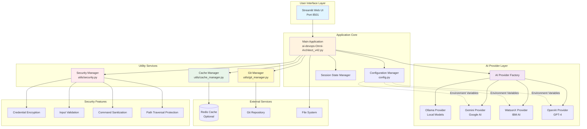
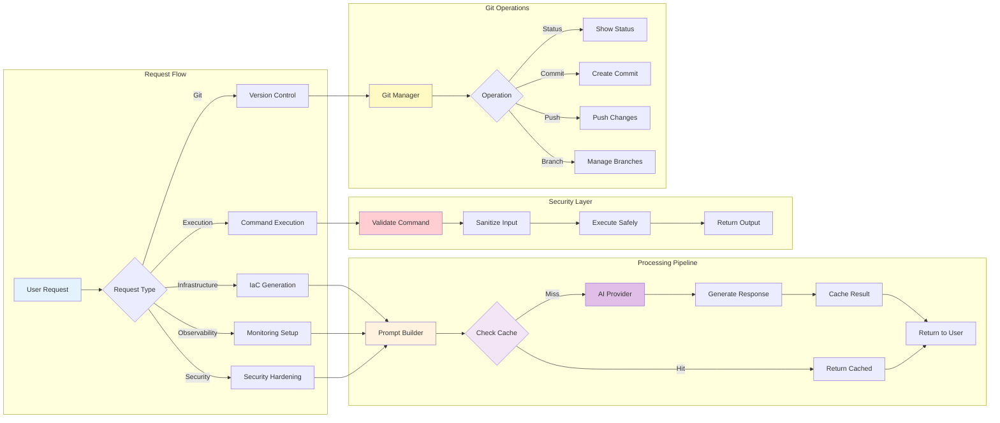
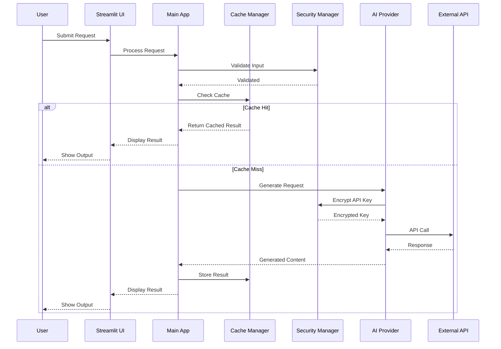
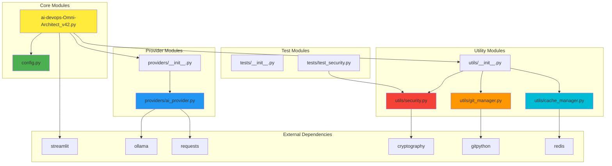
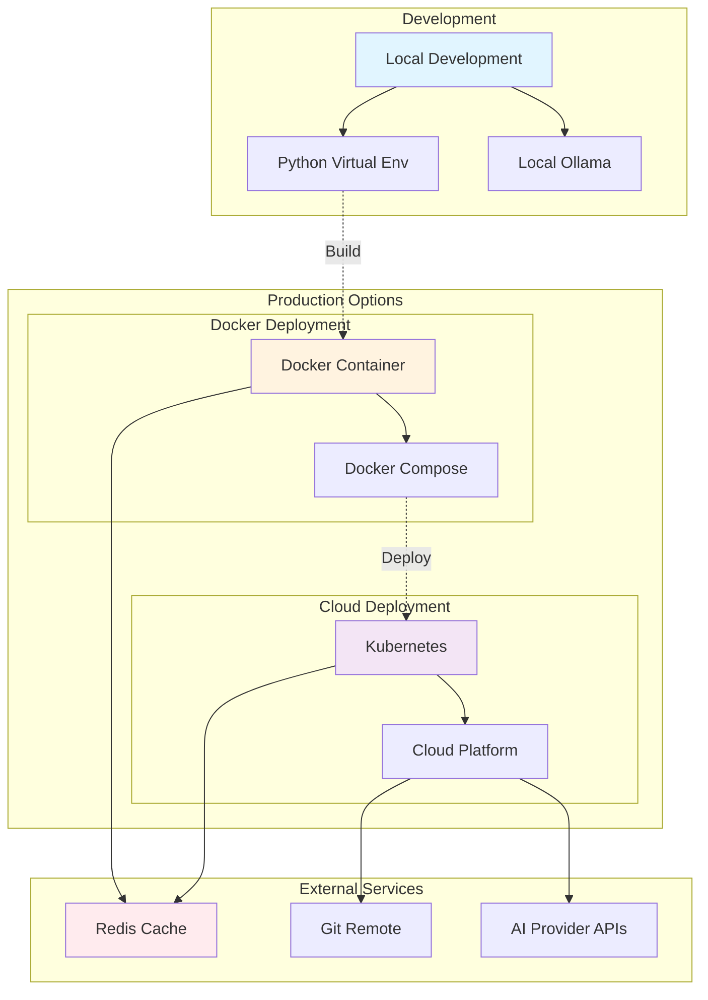
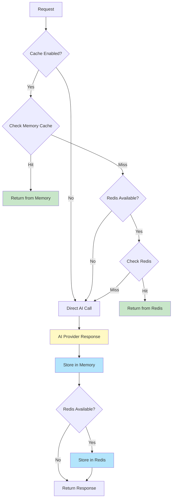

# 🏗️ AI-DevOps Omni-Architect v42 - Architecture

## System Architecture Diagram

## Component Flow Diagram

## Data Flow Architecture

## Module Dependency Graph

## Security Architecture

```mermaid
graph TB
    subgraph "Security Layers"
        INPUT[User Input]
        
        subgraph "Input Validation"
            VAL1[Type Validation]
            VAL2[Length Validation]
            VAL3[Format Validation]
        end
        
        subgraph "Path Security"
            PATH1[Path Normalization]
            PATH2[Traversal Detection]
            PATH3[Whitelist Check]
        end
        
        subgraph "Command Security"
            CMD1[Command Whitelist]
            CMD2[Argument Sanitization]
            CMD3[Shell Injection Prevention]
        end
        
        subgraph "Credential Security"
            CRED1[Encryption at Rest]
            CRED2[Secure Storage]
            CRED3[Key Rotation]
        end
        
        OUTPUT[Secure Execution]
    end

    INPUT --> VAL1
    VAL1 --> VAL2
    VAL2 --> VAL3
    VAL3 --> PATH1
    PATH1 --> PATH2
    PATH2 --> PATH3
    PATH3 --> CMD1
    CMD1 --> CMD2
    CMD2 --> CMD3
    CMD3 --> CRED1
    CRED1 --> CRED2
    CRED2 --> CRED3
    CRED3 --> OUTPUT

    style INPUT fill:#ffcdd2
    style OUTPUT fill:#c8e6c9
    style VAL1 fill:#fff9c4
    style PATH1 fill:#b3e5fc
    style CMD1 fill:#f8bbd0
    style CRED1 fill:#d1c4e9
```

## Deployment Architecture

## Cache Strategy

---

## Key Components

### 1. **Main Application** (`ai-devops-Omni-Architect_v42.py`)
- Streamlit-based web interface
- Session state management
- Request routing and orchestration
- UI rendering and user interaction

### 2. **Configuration Manager** (`config.py`)
- Environment variable management
- Application constants
- Provider configurations
- Security settings

### 3. **AI Provider Layer** (`providers/ai_provider.py`)
- Abstract provider interface
- Multiple provider implementations
- Unified API for all providers
- Error handling and validation

### 4. **Security Manager** (`utils/security.py`)
- Credential encryption/decryption
- Input validation and sanitization
- Command whitelist enforcement
- Path traversal prevention

### 5. **Cache Manager** (`utils/cache_manager.py`)
- In-memory caching
- Optional Redis integration
- TTL-based expiration
- Cache statistics

### 6. **Git Manager** (`utils/git_manager.py`)
- Repository operations
- Commit management
- Branch operations
- Remote synchronization

---

## Technology Stack

| Layer | Technologies |
|-------|-------------|
| **Frontend** | Streamlit |
| **Backend** | Python 3.9+ |
| **AI Providers** | Ollama, Gemini, WatsonX, OpenAI |
| **Caching** | In-Memory, Redis (optional) |
| **Security** | Cryptography, Input Validation |
| **Version Control** | GitPython |
| **Containerization** | Docker, Docker Compose |
| **Orchestration** | Kubernetes (optional) |

---

## Design Patterns

1. **Factory Pattern**: AI Provider creation
2. **Singleton Pattern**: Configuration and managers
3. **Strategy Pattern**: Different AI providers
4. **Decorator Pattern**: Caching layer
5. **Observer Pattern**: Session state management

---

**Built with ❤️ for DevOps Engineers and Platform Teams**